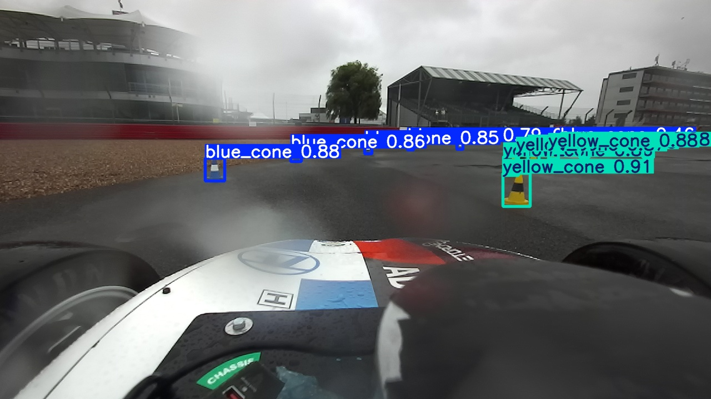
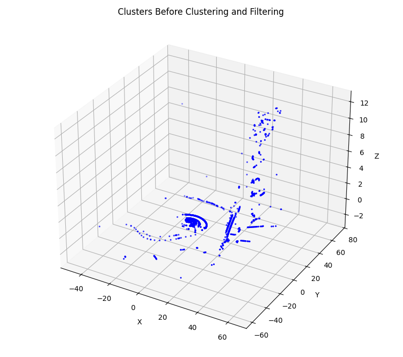
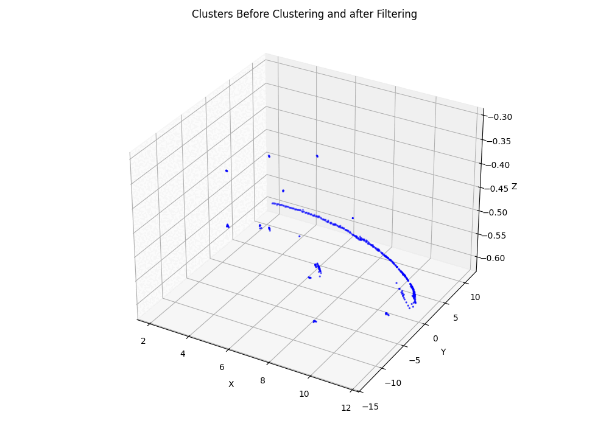
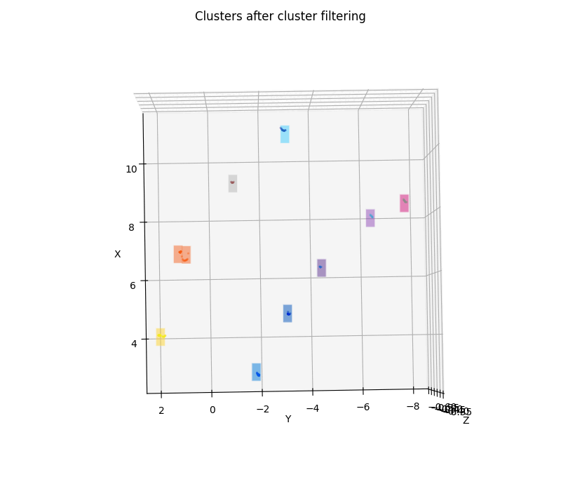

<!-- Two columns with an arrows column between them. Works on GitHub. -->

  <table width="960" cellpadding="6" cellspacing="0">
    <tr>
      <!-- LEFT 1 -->
      <td width="430" valign="top" align="center">
        
        
Image 1 caption (optional)

      </td>
      <!-- ARROW -->
      <td width="100" align="center" valign="middle"><h2>&rarr;</h2></td>
      <!-- RIGHT 1 -->
      <td width="430" valign="top" align="center">
        
        
Image 2 caption (optional)

      </td>
    </tr>
    <tr>
      <!-- LEFT 2 -->
      <td width="430" valign="top" align="center">
        
        
Image 3 caption (optional)

      </td>
      <!-- ARROW -->
      <td width="100" align="center" valign="middle"><h2>&rarr;</h2></td>
      <!-- RIGHT 2 -->
      <td width="430" valign="top" align="center">
        
        
GIF 1 caption (optional)

      </td>
    </tr>
    <tr>
      <!-- LEFT 3 (empty to keep total at 5 items) -->
      <td width="430" valign="top" align="center"></td>
      <!-- ARROW (up or right—your call) -->
      <td width="100" align="center" valign="middle"><h2>&uarr;</h2></td>
      <!-- RIGHT 3 -->
      <td width="430" valign="top" align="center">
        
        
GIF 2 caption (optional)

      </td>
    </tr>
  </table>

