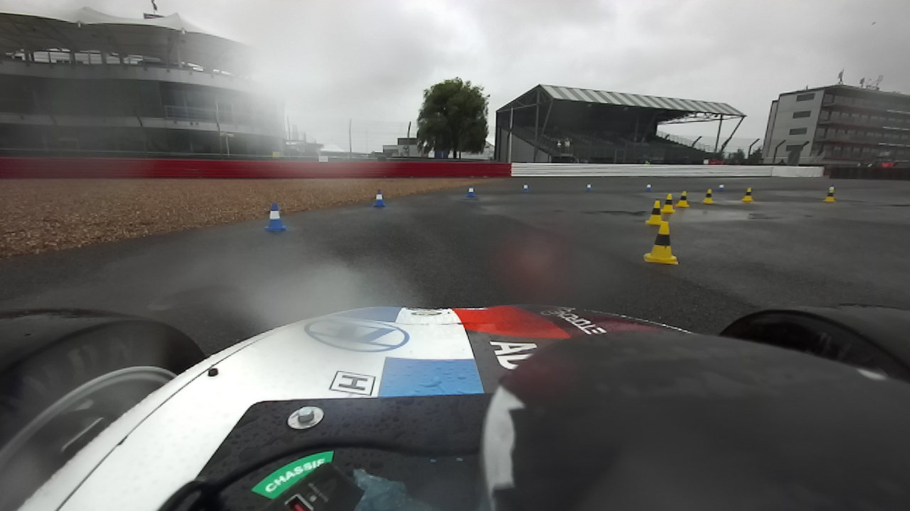

# Demonstration
A demo repo of complete code

<!-- Two columns with an arrows column between them.
     Uses only HTML attributes GitHub allows (no inline CSS). -->

  <table width="960" cellpadding="6" cellspacing="0">
    <tr>
      <!-- LEFT column 1 (Image) -->
      <td width="430" valign="top" align="center">
        
        
Image 1 caption (optional)

      </td>

      <!-- ARROW -->
      <td width="100" align="center" valign="middle">
        <h2>&rarr;</h2>
      </td>

      <!-- RIGHT column 1 (Image) -->
      <td width="430" valign="top" align="center">
        
        
Image 2 caption (optional)

      </td>
    </tr>

    <tr>
      <!-- LEFT column 2 (GIF) -->
      <td valign="top" align="center">
        
        
GIF 1 caption (optional)

      </td>

      <td align="center" valign="middle">
        <h2>&rarr;</h2>
      </td>

      <!-- RIGHT column 2 (Image) -->
      <td valign="top" align="center">
        
        
Image 3 caption (optional)

      </td>
    </tr>

    <tr>
      <!-- LEFT column 3 (GIF) -->
      <td valign="top" align="center">
        
        
GIF 2 caption (optional)

      </td>

      <td align="center" valign="middle">
        <h2>&uarr;</h2>
      </td>

      <!-- RIGHT column 3 (empty) -->
      <td valign="top" align="center">
        <!-- Empty to keep total at 5 items -->
      </td>
    </tr>
  </table>

